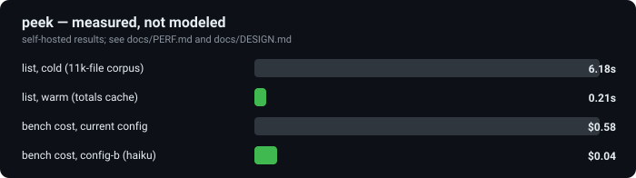

<div align="center">
  
</div>

<p align="center"><strong>See inside your coding agent's sessions — composition, cost, compactions, and config A/B — across Claude Code, Codex, and pi.</strong></p>

<p align="center">
  <a href="https://github.com/mstuart/peek/actions/workflows/ci.yml"></a>
  <a href="LICENSE"></a>
  =20">
  <a href="https://deepwiki.com/mstuart/peek"></a>
  <!-- Socket badge added at npm-publish time: [](https://socket.dev/npm/package/peek-agent) -->
</p>

<p align="center">
  <a href="#install">Install</a> ·
  <a href="#commands">Commands</a> ·
  <a href="#proof">Proof</a> ·
  <a href="#compared-to">Compared to</a> ·
  <a href="#bench">Bench</a>
</p>

---

peek reads the session logs your coding agent already writes to disk — Claude Code, Codex, pi — and turns them into historical analysis. No live instrumentation, no proxying, no telemetry. Three things make it different:

- **Exact totals, never re-tokenized.** Every number comes straight from each harness's own usage fields — peek reconciles against [ccusage](https://github.com/ccusage/ccusage) at 0.00% delta, cost included.
- **Honest composition.** Estimates are marked `~`, the unlogged remainder is named ("system prompt + tool schemas + framing") instead of hidden, and a hypothesis that didn't hold up — Codex's "near-exact" composition — is [published as refuted](docs/DESIGN.md), not quietly dropped.
- **Config A/B with real agents.** `peek bench` re-runs your own task suite under two configs and diffs the results with peek's own accounting. The [demo below](#bench) is a real run.

## Install

Requires Node 20+. Not yet on npm (`npx peek-agent` is coming); install from source:

```sh
git clone https://github.com/mstuart/peek.git && cd peek
npm install && npm run build
node dist/cli.js list
```

`npm install -g github:mstuart/peek` also works (it builds on install). Everything runs locally — no telemetry, session data never leaves your machine ([SECURITY.md](SECURITY.md)).

```
harness      session   cwd                     started           turns  tokens     cost  compactions
codex        real-cap  /…/FRd8m1Q7N8L07        2026-08-08 22:13      4   37.5k        —            0
claude-code  sess-com  /Users/you/project      2026-08-01 15:00      3   23.0k    $0.04            1
claude-code  sess-nor  /Users/you/project      2026-08-01 10:00      2    3.4k  $0.0086            0
```

## Commands

Point any command at a session id or path — or omit it to use the most recent. `--json` everywhere. Real captured output for each lives in [docs/examples/](docs/examples/).

| Command | What it does |
|---|---|
| `peek list` | Cross-harness inventory: cost, tokens, compactions. Warm in 0.21s via the totals cache. |
| `peek context` | Per-turn context composition for an ended session, residual named honestly. |
| `peek cost` | Cost attribution by model/tool/MCP server; `--all` merges every session, `--by` narrows it. |
| `peek compactions` | The compaction timeline: what shrank, what was discarded, codex window lineage. |
| `peek diff` | Composition/cost/config diff of two sessions, or `--last N` (2–5) across recent runs. |
| `peek report` | Self-contained shareable HTML — one session, `--diff <a> <b>`, or `--all` for a trends dashboard. |
| `peek bench` | Re-run a task suite under two configs with real agents ([below](#bench)). |

## Proof

<p align="center"></p>

Every number is measured, not estimated.

| Claim | Measured | Source |
|---|---|---|
| Totals reconcile against ccusage | 0.00% delta, every token class + cost, at matched scope | [docs/DESIGN.md](docs/DESIGN.md) |
| Real-corpus parse success | 100% — 2,000 real Claude Code sessions, 67,458 turns, 0 failures (point-in-time) | [`test/local.integration.test.ts`](test/local.integration.test.ts) |
| `peek bench` A/B gate | `current` vs `model=haiku`: both passed, −93.4% cost, −19.1% tokens | [docs/examples/bench-report.txt](docs/examples/bench-report.txt) |
| `peek list` cold → warm | 6.18s → 0.21s (totals cache, 7,526 hits) | [docs/PERF.md](docs/PERF.md) |
| Codex "near-exact" hypothesis | Refuted and published: 67.4% residual measured, not restated as success | [docs/DESIGN.md](docs/DESIGN.md) |

## Compared to

The real bar is native tooling: Claude Code's own [`/context`](https://code.claude.com/docs/en/context-window) and [`/usage`](https://code.claude.com/docs/en/costs#track-your-costs) do live composition and attribution for free — peek never competes there. peek's edge is *historical* analysis across three harnesses after a session ends.

| | Historical composition | Cross-harness | Compaction analysis | Cost depth | Session diff | CLI + JSON |
|---|---|---|---|---|---|---|
| Native `/context` + `/usage` | No | No | No | Live only | No | No |
| [ccusage](https://github.com/ccusage/ccusage) | No | Yes — totals | No | Totals only | No | Yes |
| [claude-devtools](https://github.com/matt1398/claude-devtools) | Yes | Claude Code only | Yes | Per-subagent | No | GUI only |
| [agent-replay](https://github.com/clay-good/agent-replay) | No | Yes — traces | No | No | Step-level | Yes |
| **peek** | Yes | Claude Code, Codex, pi | Yes | Per-tool/MCP/subagent | Whole-session | Yes |

Stated plainly: ccusage already owns cross-harness cost *totals* (peek's edge is attribution *depth*, not totals); claude-devtools already does composition and per-subagent cost trees (but Claude-Code-only, GUI-only). **Skip peek** if you want live in-session monitoring (use `/context`), only need cost totals (use ccusage), or only use Claude Code and want a GUI (use claude-devtools).

## Bench

Every other command is read-only. `peek bench` runs agents: it re-runs your task suite under two config variants — a `CLAUDE.md`/`AGENTS.md`/`settings.json`/`model` overlay, or `current` — in isolated `git worktree`s, verified by *your* test command, then parses each trial's own session log for exact tokens, cost, and compactions. Trials hit the real APIs and cost money; this repo ships the gate's suite at [`.peek/bench/`](.peek/bench/).

```sh
peek bench run --suite .peek/bench --config-a current --config-b .peek/bench/configs/haiku
```

```
peek bench — current (a) vs config-b (b)

task        success a   success b   wall Δ           tokens Δ            cost Δ
hello-file  1/1 (100%)  1/1 (100%)  +1.1s (+13.5%)   -15,864 (-19.1%)   -$0.54 (-93.4%)
```

Both configs passed `verify`; switching to haiku cut cost 93.4% for +1.1s wall — a real run, not a projection.

**Not a sandbox.** A worktree is a filesystem convention, not a security boundary — trial agents run with your OS permissions, so only bench task suites you trust. A first-run or changed suite requires explicit trust confirmation (every command shown verbatim, direnv-style); `--yes` skips the cost estimate but never the trust prompt. Per harness: **claude-code** is fully gated (the result above); **codex** has a runner verified with a real trial but no orchestrated A/B yet; **pi** is deferred to v2.1.

## Status

v1 shipped through a five-round, three-lens adversarial audit (27 → 0 findings) before implementation; v2 added `peek bench`, the totals cache, `cost --all`, pi System B, and the report dashboard. Verified, not just designed: 100% real-corpus parse, clean-room packaging, a privacy audit, and a full performance profile — details and the measured-results ledger in [docs/DESIGN.md](docs/DESIGN.md), [docs/PERF.md](docs/PERF.md), [docs/PRIVACY-AUDIT.md](docs/PRIVACY-AUDIT.md), and [docs/BUILDLOG.md](docs/BUILDLOG.md).

**Known limitations:** pi is source-verified only (no real pi data validated yet); Codex composition is measured at a 67.4% residual, not near-exact — see the [Codex and pi caveats in docs/DESIGN.md](docs/DESIGN.md).

## License

MIT — see [LICENSE](LICENSE).
